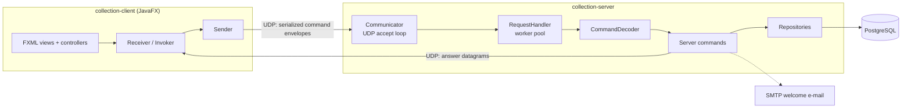

# Collection Management Application

[](https://github.com/Ali-Alibekovich/collection-management-application/actions/workflows/ci.yml)


Client-server application for interactive management of a collection of `Organization`
objects. A JavaFX client talks to a multithreaded UDP server; the collection and user
accounts are persisted in PostgreSQL.

## Features

- **JavaFX client** — login/registration, a live table view of the collection,
  create/update dialogs, sorting and filtering, and an animated canvas
  visualization where every user's objects are painted in their personal colour.
- **User accounts** — registration and login with bcrypt-hashed passwords;
  every element belongs to its creator, and only the owner can update or delete it.
- **UDP protocol** — commands travel as serialized envelopes
  (`SerializedArgumentCommand`, `SerializedObjectCommand`, …) shared by both sides
  through the `collection-common` module.
- **PostgreSQL persistence** — the collection and users survive restarts;
  repositories use prepared statements throughout.
- **Internationalization** — the UI ships with Russian, English, Polish and
  Norwegian locales, switchable at runtime.
- **E-mail notifications** — an optional SMTP integration greets newly
  registered users (disabled automatically when no mail account is configured).

## Architecture



The project is a three-module Maven build:

| Module | Contents |
| --- | --- |
| `common` | Domain model (`Organization`, `Coordinates`, …) and the serializable command protocol |
| `server` | UDP endpoint, command execution, PostgreSQL repositories, mail notifications |
| `client` | JavaFX UI, client-side commands, i18n resources |

A deeper dive — wire protocol, threading model, database schema — lives in
[`docs/architecture.md`](docs/architecture.md).

## Getting started

Prerequisites: **JDK 17+**, **Maven 3.9+**, **Docker** (for the local database).

```bash
# 1. Start PostgreSQL
docker compose up -d

# 2. Build everything
mvn package -DskipTests

# 3. Run the server (defaults match docker-compose)
java -jar server/target/collection-server-1.0.0.jar

# 4. Run the client
mvn -pl client javafx:run
```

By default the client connects to `localhost:5555`. To point it elsewhere:

```bash
mvn -pl client javafx:run -Dclient.args="myhost 5555"
```

### Configuration

The server is configured through environment variables:

| Variable | Default | Purpose |
| --- | --- | --- |
| `DB_URL` | `jdbc:postgresql://localhost:5432/collection` | JDBC connection string |
| `DB_USER` | `collection` | Database user |
| `DB_PASSWORD` | `collection` | Database password |
| `MAIL_USER` | — | SMTP account for welcome e-mails (optional) |
| `MAIL_PASSWORD` | — | SMTP account password (optional) |
| `SMTP_HOST` | `smtp.yandex.ru` | SMTP server |
| `SMTP_PORT` | `465` | SMTP SSL port |

When `MAIL_USER`/`MAIL_PASSWORD` are not set, registration works normally and
the welcome e-mail is simply skipped.

## Testing

```bash
mvn verify
```

- Unit tests cover the serialization protocol and password hashing.
- Integration tests spin up a real PostgreSQL in Docker via
  [Testcontainers](https://testcontainers.com/) and exercise the repositories,
  including a regression test for credential validation.
- If your Docker daemon cannot reach Docker Hub, point the tests at a mirror:
  `mvn verify -Dpostgres.image=public.ecr.aws/docker/library/postgres:16-alpine`.

## Project structure

```
├── common/   # shared domain model + command protocol (+ protocol tests)
├── server/   # UDP server, repositories, integration tests
├── client/   # JavaFX client, FXML views, i18n bundles
├── docs/     # architecture deep dive
└── docker-compose.yml
```

## Limitations and future work

The wire protocol is intentionally simple and has known trade-offs that make
good candidates for future iterations:

- credentials accompany every request and travel unencrypted (no DTLS/TLS);
- datagrams are capped at 4 KB, so very large collections need chunking;
- no delivery guarantees beyond what UDP provides;
- the JavaFX client performs network calls on the UI thread.

## Acknowledgements

The application grew out of ITMO University programming coursework
(originally built together with [@cantansweratthemoment](https://github.com/cantansweratthemoment))
and was later restructured into a multi-module Maven project with tests, CI and
containerized infrastructure.
