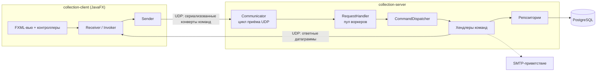

# Collection Management Application

[English](README.md) | **Русский**

[](https://github.com/Ali-Alibekovich/collection-management-application/actions/workflows/ci.yml)


Клиент-серверное приложение для интерактивного управления коллекцией объектов
`Organization`. JavaFX-клиент общается с многопоточным UDP-сервером; коллекция
и учётные записи пользователей хранятся в PostgreSQL.

## Возможности

- **JavaFX-клиент** — вход и регистрация, живая таблица коллекции, диалоги
  создания и редактирования, сортировка и фильтрация, а также анимированная
  canvas-визуализация, где объекты каждого пользователя раскрашены его
  персональным цветом.
- **Учётные записи** — регистрация и вход с паролями, захэшированными bcrypt;
  каждый элемент принадлежит своему создателю, и только владелец может его
  изменить или удалить.
- **UDP-протокол** — команды передаются сериализованными «конвертами»
  (`SerializedArgumentCommand`, `SerializedObjectCommand`, …), общими для обеих
  сторон через модуль `collection-common`.
- **Хранение в PostgreSQL** — коллекция и пользователи переживают перезапуски;
  репозитории используют только prepared statements.
- **Интернационализация** — интерфейс поставляется с русской, английской,
  польской и норвежской локалями, переключаемыми на лету.
- **E-mail-уведомления** — опциональная SMTP-интеграция приветствует новых
  пользователей (автоматически отключается, если почтовый аккаунт не настроен).

## Архитектура



Проект — трёхмодульная Maven-сборка:

| Модуль | Содержимое |
| --- | --- |
| `common` | Доменная модель (`Organization`, `Coordinates`, …) и сериализуемый протокол команд |
| `server` | UDP-эндпоинт, реестр хендлеров (Strategy) с внедрением зависимостей через конструкторы, репозитории PostgreSQL, почтовые уведомления |
| `client` | JavaFX-интерфейс, клиентские команды, ресурсы локализации |

Подробный разбор — wire-протокол, модель потоков, схема БД — в
[`docs/architecture.md`](docs/architecture.md); ключевые решения зафиксированы
как ADR в [`docs/adr`](docs/adr).

## Быстрый старт

Требования: **JDK 17+**, **Maven 3.9+**, **Docker** (для локальной базы).

```bash
# 1. Поднять PostgreSQL
docker compose up -d

# 2. Собрать всё
mvn package -DskipTests

# 3. Запустить сервер (дефолты совпадают с docker-compose;
#    либо в контейнере: docker compose --profile full up --build)
java -jar server/target/collection-server-1.0.0.jar

# 4. Запустить клиент
mvn -pl client javafx:run
```

По умолчанию клиент подключается к `localhost:5555`. Чтобы указать другой адрес:

```bash
mvn -pl client javafx:run -Dclient.args="myhost 5555"
```

### Конфигурация

Сервер настраивается переменными окружения:

| Переменная | Значение по умолчанию | Назначение |
| --- | --- | --- |
| `DB_URL` | `jdbc:postgresql://localhost:5432/collection` | Строка подключения JDBC |
| `DB_USER` | `collection` | Пользователь базы |
| `DB_PASSWORD` | `collection` | Пароль базы |
| `MAIL_USER` | — | SMTP-аккаунт для приветственных писем (опционально) |
| `MAIL_PASSWORD` | — | Пароль SMTP-аккаунта (опционально) |
| `SMTP_HOST` | `smtp.yandex.ru` | SMTP-сервер |
| `SMTP_PORT` | `465` | SSL-порт SMTP |

Если `MAIL_USER`/`MAIL_PASSWORD` не заданы, регистрация работает как обычно,
а приветственное письмо просто не отправляется.

## Тестирование

```bash
mvn verify
```

- Юнит-тесты покрывают протокол сериализации, хэширование паролей, операции
  над коллекцией, компараторы сортировки, разбор JSON и паритет локалей i18n.
- Конкурентность защищена на трёх уровнях: многопоточные юнит-тесты
  (генерация ID, мутации коллекции, сканы под локом), **jcstress**-суита для
  атомарности пула идентификаторов на уровне модели памяти JVM и сквозной
  тест, который поднимает настоящий сервер в отдельной JVM и обстреливает его
  24 конкурентными обменами register/login по UDP.
- Интеграционные тесты поднимают настоящий PostgreSQL в Docker через
  [Testcontainers](https://testcontainers.com/) и проверяют репозитории,
  включая регрессионный тест проверки учётных данных.
- **Покрытие** — JaCoCo работает на каждой сборке с помодульными порогами
  (common 45%, server 20%). JavaFX-клиент без порога: тестирование UI-слоя
  требует TestFX и разделения контроллеров и сетевого кода — это в планах.
- Если ваш Docker не достаёт до Docker Hub, укажите зеркало:
  `mvn verify -Dpostgres.image=public.ecr.aws/docker/library/postgres:16-alpine`.

Стресс-суита запускается отдельно (и отдельным CI-job):

```bash
mvn -pl stress -am package -DskipTests
java -jar stress/target/jcstress.jar -m sanity
```

## Структура проекта

```
├── common/   # общая доменная модель + протокол команд (+ тесты протокола)
├── server/   # UDP-сервер, репозитории, интеграционные тесты
├── client/   # JavaFX-клиент, FXML-вью, бандлы i18n
├── stress/   # jcstress-суита конкурентности
├── docs/     # разбор архитектуры + ADR
└── docker-compose.yml
```

## Ограничения и планы

Wire-протокол намеренно прост, и у него есть известные компромиссы — хорошие
кандидаты на следующие итерации:

- учётные данные сопровождают каждый запрос и передаются в открытом виде
  (нет DTLS/TLS);
- датаграммы ограничены 4 КБ, поэтому очень большим коллекциям нужен чанкинг;
- никаких гарантий доставки сверх того, что даёт UDP;
- JavaFX-клиент делает сетевые вызовы в UI-потоке.

## Благодарности

Приложение выросло из учебного проекта Университета ИТМО (курс
программирования; изначально делалось вместе с
[@cantansweratthemoment](https://github.com/cantansweratthemoment)), а затем
было переструктурировано в многомодульный Maven-проект с тестами, CI и
контейнеризованной инфраструктурой.
