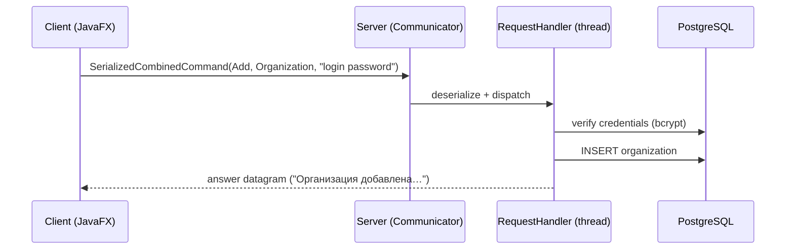

# Architecture

## Modules

The build is a three-module Maven reactor:

```
collection-management-application (pom)
├── common   → collection-common.jar
├── server   → collection-server.jar (shaded, executable)
└── client   → collection-client.jar (run via javafx-maven-plugin)
```

`common` is the only shared dependency: it contains the domain model and the
command protocol. `client` and `server` never depend on each other.

## Wire protocol

Transport is UDP with plain Java serialization. Every request is one of four
**envelopes** defined in `common`:

| Envelope | Payload | Typical commands |
| --- | --- | --- |
| `SerializedSimplyCommand` | — | ping-like requests |
| `SerializedArgumentCommand` | `String` | `login`, `info`, `remove_by_id`, filters |
| `SerializedObjectCommand` | `Object` | object-only requests |
| `SerializedCombinedCommand` | `Object` + `String` | `add`, `update`, `add_if_min` |

An envelope carries a `Command` instance. `Command` itself is a **marker
interface**; the client and the server each define a class with the *same fully
qualified name* for every command (e.g. `protocol.commands.Login`), with a fixed
`serialVersionUID`:

- the **client twin** extends `ClientCommand` — it validates user input and
  builds the request;
- the **server twin** extends `ServerCommand` — it executes the command against
  the collection and the database.

Java serialization resolves classes by name during deserialization, so a
command object serialized by the client is materialized on the server as the
server-side twin. Field mismatch is not an issue: command objects are
stateless (client-side references such as the receiver are `transient`).



Answers are plain UTF-8 datagrams: human-readable messages, or JSON when the
client asked for the collection (`show`, `visualize`).

## Server

- `Communicator` — blocking receive loop on a single channel; every datagram
  is copied out of the receive buffer and dispatched to a bounded worker pool
  (`RequestHandler`).
- `CommandDispatcher` — unwraps the envelope and routes it to the
  `CommandHandler` registered for the command's class (Strategy); server twins
  are pure data markers (ADR 0004).
- Handlers — one class per command; credential checks live in the
  `AuthenticatedHandler` template, dependencies come in through constructors
  wired in `Main` (composition root), answers are returned as strings and sent
  by the net layer.
- `OrganizationCollection` — instance-based, thread-safe in-memory view of the
  collection backed by the `OrganizationStore` abstraction.
- Repositories (`OrganizationsRepository`, `UsersRepository`) — plain JDBC with
  prepared statements implementing the `OrganizationStore`/`UserStore`
  interfaces. Tables are created on startup (`CREATE TABLE IF NOT EXISTS`),
  so no migration step is needed for a fresh database.

### Authentication

Registration stores a **bcrypt** hash (salt embedded). Login and every
subsequent request verify the login/password *pair* with
`UsersRepository.checkCredentials`, which fetches the hash for the given login
and runs `BCrypt.checkpw`. Each user also owns a unique display colour used by
the client-side visualization.

### Database schema

```sql
users (
  login     TEXT PRIMARY KEY,
  password  TEXT NOT NULL,   -- bcrypt hash
  color     TEXT NOT NULL    -- unique per user, used by the visualization
)

organizations (
  id             SERIAL PRIMARY KEY,
  owner          TEXT NOT NULL,             -- login of the creator
  name           TEXT NOT NULL,
  x, y           DOUBLE PRECISION NOT NULL, -- coordinates
  creationDate   TEXT NOT NULL,
  annualTurnover DOUBLE PRECISION NOT NULL,
  organizationType TEXT NOT NULL,
  street, zipCode, town TEXT NOT NULL,
  location_x, location_y DOUBLE PRECISION NOT NULL,
  color          TEXT NOT NULL
)
```

## Client

- `ConsoleManager` / `Invoker` — command registry and dispatch (the
  command-pattern core predates the GUI and still drives it).
- `Receiver` — builds envelopes, sends them through `Sender`, parses answers
  and updates the JavaFX views.
- `ui` package — FXML controllers for the welcome, login, registration, table,
  sorting and editing views.
- `i18n` — `ResourceBundle`-based localization (ru, en, pl, no), switchable at
  runtime from the UI.

## Testing

- `common` — serialization round-trip tests for the envelopes and the model.
- `server` — bcrypt unit tests plus Testcontainers-based integration tests
  (`*IT`, run by maven-failsafe during `mvn verify`) against a real PostgreSQL.
  The image is configurable via `-Dpostgres.image=…` for environments where
  Docker Hub is unreachable.

## Known trade-offs

- No transport security: credentials travel in cleartext inside datagrams.
- The 4 KB datagram limit bounds the collection size for `show`/`visualize`.
- UI-thread networking in the client can freeze the interface on a slow link.
